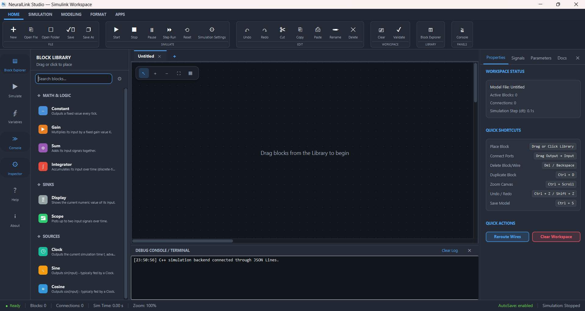
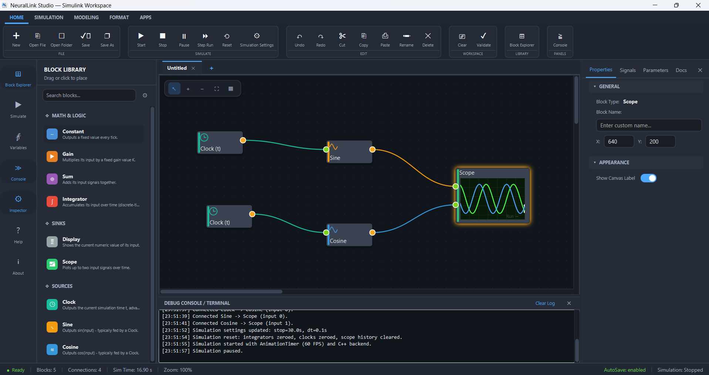
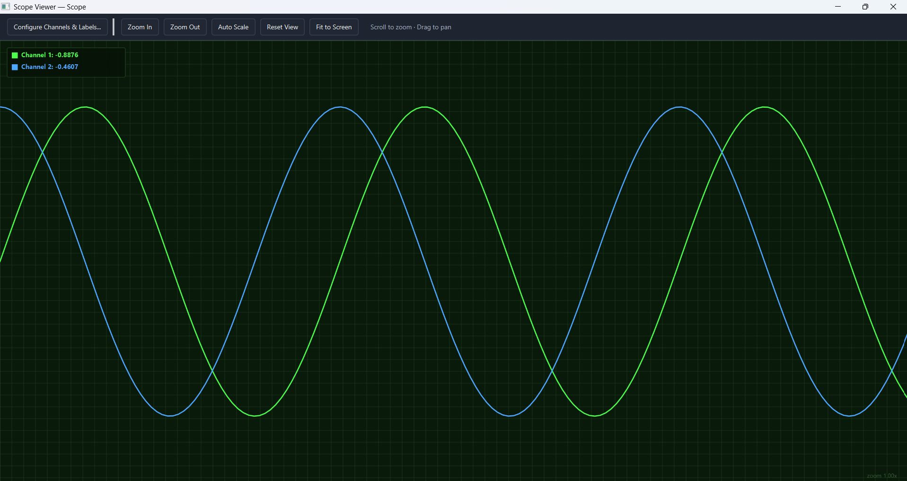

# NeuralLink Studio


**IITM Assignment Edition** · a dual-engine, block-diagram signal simulator

NeuralLink Studio is a graphical block-diagram simulator with a JavaFX frontend
and a native C++ simulation backend. Drag blocks onto a canvas, wire them
together, and watch the result on a live, multi-channel oscilloscope — built
to satisfy the IITM Assignment 1 brief for a Java/JavaFX + C++ modeling tool.

---

## Table of contents

- [What it does](#what-it-does)
- [Two ways to run it](#two-ways-to-run-it)
  - [Option 1 — `run.bat` (build from source)](#option-1--runbat-build-from-source)
  - [Option 2 — Download the installer](#option-2--download-the-installer)
- [Manual run (advanced)](#manual-run-advanced)
- [System requirements](#system-requirements)
- [Project structure](#project-structure)
- [Architecture](#architecture)
- [Block library](#block-library)
- [The IITM required model](#the-iitm-required-model)
- [Building the Windows installer yourself](#building-the-windows-installer-yourself)
- [Testing](#testing)
- [Troubleshooting](#troubleshooting)
- [Documentation index](#documentation-index)
- [Screenshots](#screenshots)
- [Future improvements](#future-improvements)
- [Contributing](#contributing)
- [License](#license)
- [Credits](#credits)

---

## What it does

- **Modern Ribbon UI** — simulation controls, a library browser, and a
  properties panel, all one click away.
- **Dual-engine simulation** — a compiled C++ engine drives the core signal
  sources (Clock, Sine, Cosine); a Java engine handles math and logic blocks
  (Gain, Sum, Integrator, Constant, Display).
- **Interactive Scope** — real-time multi-channel plotting with zoom, pan, and
  auto-scale.
- **Auto-routing wires** — intelligent pathfinding lays out clean connections
  as you draw them.
- **Five workspace wire styles** — Straight Line, Cubic Curve, Rectangular /
  Orthogonal, Horizontal-Vertical, and Polyline. Each workspace defaults to
  Cubic Curve and locks its selected style while connections exist.
- **Three integration solvers** — Euler, Midpoint RK2, and RK4 can be selected
  from the Simulation ribbon and take effect immediately.
- **Minimap** — a high-level overview for navigating large models.
- **Scope axes and live scaling** — the resizable Scope viewer shows Time and
  Amplitude axes and continuously scales its Y range from connected signals.
- **Slate Blue theme** — toggle instantly between the original dark interface
  and the Slate Blue palette from the Modelling ribbon.
- **Workspace-safe canvas state** — every tab owns its placeholder and canvas
  controls, so adding or removing blocks in one workspace does not affect
  another.
- **IITM Compliance Mode** — validates any model named for the assignment
  against the required four-block flow.
- **Animated splash screen** — a bundled, fully local JavaFX splash; no
  internet connection or external CDN required.

## Two ways to run it

There are two supported paths — pick whichever fits you. You don't need both.

### Option 1 — `run.bat` (build from source)

**Read [`WINDOWS_README.md`](WINDOWS_README.md) first** — it covers the exact
requirements, what the script does step by step, and where to look if
something goes wrong. Don't skip it; it will save you a support round-trip.

Once you've read it:

1. Download or clone the complete project from the GitHub repository, then
   extract it if needed.
2. Open the project folder.
3. Double-click `run.bat`.
4. Follow the prompts — it checks your project files, verifies your system
   meets the requirements, and installs anything missing (Java, Maven,
   MinGW) with your permission.
5. The application compiles and opens automatically. Leave the console
   window open in the background while you work.
6. Close the app — `run.bat` automatically cleans up any temporary files and
   uninstalls only the components it installed for you.

If the packaged app doesn't open and you're on the installed build instead of
`run.bat`, run `SHOW_STARTUP_ERROR.bat` to view the startup log at
`%LOCALAPPDATA%\NeuralLink Studio\logs\startup-error.log`.

### Option 2 — Download the installer

If you'd rather skip building anything yourself:

1. Download the latest Windows `.exe` installer
   (`NeuralLinkStudio-Setup-1.0.1.exe`) from the **Releases** section of the
   GitHub repository, or from
   **https://neurallink-studio-installer.netlify.app/**.
   > **Use Google Chrome to download the installer.** Downloading and
   > installing via Microsoft Edge is not supported and may fail partway
   > through — use Chrome for this step.
2. **Before running the installer**, disable Smart App Control so Windows
   doesn't block the unsigned installer: go to **Settings → Windows Security
   → App & Browser Control → Smart App Control** and turn it **Off**.
3. Double-click the downloaded installer. Since it isn't digitally signed,
   Windows will show a security warning — click **More info**, then **Run
   anyway**.
4. Follow the installation wizard to complete the setup; the application
   will then be installed successfully.
5. Launch NeuralLink Studio from the Start Menu or the optional desktop
   shortcut, and start working.

Java, Maven and MinGW are **not** required on the destination machine — the
installer bundles a private Java runtime, the JavaFX native libraries, and the
compiled C++ backend, plus Start Menu/desktop shortcuts and a standard Windows
uninstaller.

## Manual run (advanced)

If you already have JDK 17+, Maven 3.9+, and MinGW-w64 g++ installed and
prefer to skip the launcher script:

```bat
cd path\to\NeuralLink-Studio
mvn clean compile javafx:run
```

## System requirements

| Component                  | Version       | Notes                                                                        |
| -------------------------- | ------------- | ---------------------------------------------------------------------------- |
| Operating System           | Windows 10/11 | 64-bit architecture required                                                 |
| Java Development Kit (JDK) | 17 or newer   | Only needed to build/run from source — the installer bundles its own runtime |
| Apache Maven               | 3.9 or newer  | Dependency management and building                                           |
| MinGW-w64 (g++)            | C++17 support | Compiles the simulation backend                                              |
| Inno Setup 6               | —             | Only needed if you're building the installer yourself                        |

If you use VS Code, the _Extension Pack for Java_, _Maven for Java_, and
_C/C++_ extensions are recommended.

## Project structure

```
NeuralLink-Studio/
├── README.md                    ← you are here
├── WINDOWS_README.md            ← read before using run.bat or the installer
├── PROJECT_GUIDE.md             ← features, workflow, block parameters
├── IITM_COMPLIANCE.md           ← how the project satisfies the assignment brief
├── run.bat / run.sh             ← one-command build & launch
├── build-installer.bat          ← builds the Windows installer end-to-end
├── CHECK_REQUIREMENTS.bat       ← verifies installer build tooling is present
├── SHOW_STARTUP_ERROR.bat       ← opens the packaged app's startup error log
├── pom.xml                      ← Maven build (compiles Java + the C++ backend)
├── .gitignore                   ← excludes target/, build/, dist/, compiled backend
├── backend/
│   ├── simulation_backend.cpp   ← C++ engine for every supported block and solver
│   ├── build-backend.bat/.sh    ← standalone backend build scripts
│   └── simulation_backend.exe*  ← *rebuilt by Maven/run.bat, not tracked in git
├── examples/
│   └── iitm-required-model.json ← the exact four-block assignment model
├── installer/
│   ├── NeuralLinkStudio.iss     ← Inno Setup script
│   ├── app_icon.ico, wizard-*.bmp
│   └── assets/                  ← installer wizard artwork
├── scripts/                     ← installer build/clean/validate/smoke-test helpers
├── screenshorts/                ← README screenshots (Project_Interface, Simulation, Output_scope)
└── src/
    ├── main/java/com/simulink/  ← App, Launcher, commands/, model/, ui/, backend/
    ├── main/resources/          ← icons, splash screen assets, scrollbar.css
    └── test/java/com/simulink/  ← AppTest, IitmComplianceTest
```

`target/`, `build/`, and `dist/` are build output — they're excluded by
`.gitignore` and are not part of this tree. They're regenerated by Maven,
`run.bat`, or `build-installer.bat`.

## Architecture

The JavaFX frontend manages the workspace and renders the values returned by
the native simulation engine.

```
 JavaFX Frontend                     C++ Simulation Backend
 ─────────────────                  ─────────────────────────
 Canvas, ribbon,          <──JSON──  All supported blocks and
 library browser,           Lines    Integrator solver methods
 properties, minimap, Scope         (persistent native process)
```

- `App.java` drives the UI and talks to `CppSimulationBackend.java`, which
  opens `backend/simulation_backend.exe` as a persistent child process and
  exchanges one JSON object per line (`{"command":"compute", ...}` in,
  `{"ok":true,"value":...}` out).
- The C++ side (`simulation_backend.cpp`) answers `ping` and `compute` for
  `Clock`, `Sine`, `Cosine`, `Scope`, `Gain`, `Sum`, `Integrator`, `Constant`,
  and `Display`. Integrator requests support Euler, Midpoint RK2, and RK4.
- The simulation loop is a JavaFX `AnimationTimer` running once per display
  pulse (~60 FPS); connections are drawn as JavaFX `CubicCurve`s bound to
  block ports, and every block is a `BlockNode` extending `StackPane` placed
  on a draggable `Pane` canvas.

## Block library

### Source blocks

| Block  | Parameters                        | Description                             |
| ------ | --------------------------------- | --------------------------------------- |
| Clock  | —                                 | Outputs the current simulation time `t` |
| Sine   | Amplitude, Frequency, Phase, Bias | `A·sin(2π·f·t + p) + b`                 |
| Cosine | Amplitude, Frequency, Phase, Bias | `A·cos(2π·f·t + p) + b`                 |

### Math & logic blocks

| Block      | Parameters        | Description                                      |
| ---------- | ----------------- | ------------------------------------------------ |
| Constant   | Value             | Outputs a fixed numerical value                  |
| Gain       | Gain              | Multiplies the input signal by a constant factor |
| Sum        | Inputs            | Adds or subtracts multiple input signals         |
| Integrator | Initial Condition | Integrates the input signal over time            |

### Sink blocks

| Block   | Parameters       | Description                                 |
| ------- | ---------------- | ------------------------------------------- |
| Display | Format           | Shows the current value of the input signal |
| Scope   | Channels, Labels | Plots one or more signals over time         |

Each block's parameters can be edited from the Properties panel, or by
double-clicking the block directly. See [`PROJECT_GUIDE.md`](PROJECT_GUIDE.md)
for the full workflow guide.

## The IITM required model

For the assignment demonstration, the project ships a ready-made model that
follows the exact required four-block flow:

1. **Clock** output → **Sine** input
2. **Clock** output → **Cosine** input
3. **Sine** output → **Scope** input 1
4. **Cosine** output → **Scope** input 2

Open `examples/iitm-required-model.json` from the application, then use the
**Validate** button to confirm the model matches this required flow. Extra
blocks (Constant, Gain, Sum, Integrator, Display) are available in the
toolbox for your own diagrams but aren't part of this specific graded model.
See [`IITM_COMPLIANCE.md`](IITM_COMPLIANCE.md) for the full requirement-by-
requirement mapping.

## Building the Windows installer yourself

On a Windows build machine with JDK 17+, Maven, MinGW-w64, and Inno Setup 6:

```bat
CHECK_REQUIREMENTS.bat
build-installer.bat
```

This performs, in order: tool validation, static C++ compilation, Maven
tests, private runtime creation (`jlink`), `jpackage` app-image creation,
file validation, a launcher smoke test, and Inno Setup compilation. The
output is `dist\NeuralLinkStudio-Setup-1.0.1.exe`, and the full build log is
written under `build\logs\`. Use `scripts\clean-installer.bat` to reset
`build\` and `dist\` between attempts.

## Testing

```bat
mvn test
```

The suite covers the exact four-block factory, `BlockNode`'s `StackPane`
inheritance, wire auto-routing (`RouteGrid`), and live computations from the
compiled C++ process (`IitmComplianceTest`).

## Troubleshooting

- **Backend error** — make sure the MinGW `g++` compiler is on your system
  `PATH`. `run.bat` attempts to verify this automatically.
- **Java/Maven missing** — `run.bat` includes an automated check and will
  offer to install missing components.
- **Installed app won't open** — run `SHOW_STARTUP_ERROR.bat` to view
  `%LOCALAPPDATA%\NeuralLink Studio\logs\startup-error.log`.
- **Broken folders** — if the project structure looks corrupted, re-extract
  the source, or use the installer from
  https://neurallink-studio-installer.netlify.app/ for a clean install.
- **Shortcut still shows the old icon** — run
  `scripts\refresh-windows-icon-cache.bat` to clear the Windows icon cache.

## Documentation index

| File                                       | What it covers                                                              |
| ------------------------------------------ | --------------------------------------------------------------------------- |
| [`WINDOWS_README.md`](WINDOWS_README.md)   | Read first — end-user run steps, developer build steps, startup diagnostics |
| [`PROJECT_GUIDE.md`](PROJECT_GUIDE.md)     | Features, workflow, and block parameter reference                           |
| [`IITM_COMPLIANCE.md`](IITM_COMPLIANCE.md) | Requirement-by-requirement mapping to the codebase                          |

## Screenshots

| Project Interface | Simulation | Output Scope |
| --- | --- | --- |
|  |  |  |

## Future improvements

- Linux and macOS support
- Save/open project files
- Export simulation results to PDF
- Plugin architecture for custom blocks
- More engineering blocks
- Performance optimisation for large models
- AI-assisted model generation
- Real-time debugging
- Multi-threaded simulation

## Contributing

Contributions are welcome.

1. Fork the repository.
2. Create a feature branch:
   ```bash
   git checkout -b feature-name
   ```
3. Commit your changes:
   ```bash
   git commit -m "Add new feature"
   ```
4. Push to GitHub:
   ```bash
   git push origin feature-name
   ```
5. Open a Pull Request.

## License

This project is licensed under the MIT License.

## Credits

Created by **Anuvarshan.M**
[GitHub — shakthicode](https://github.com/shakthicode) ·
[LinkedIn — anuvarshan06](https://www.linkedin.com/in/anuvarshan06/)
